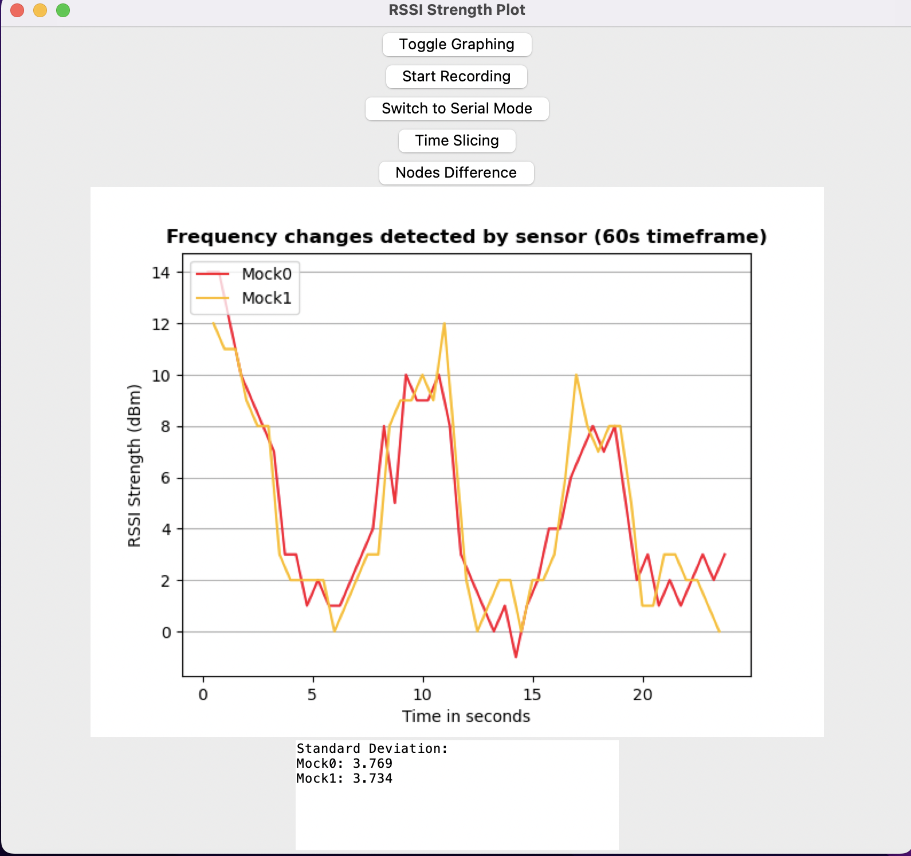
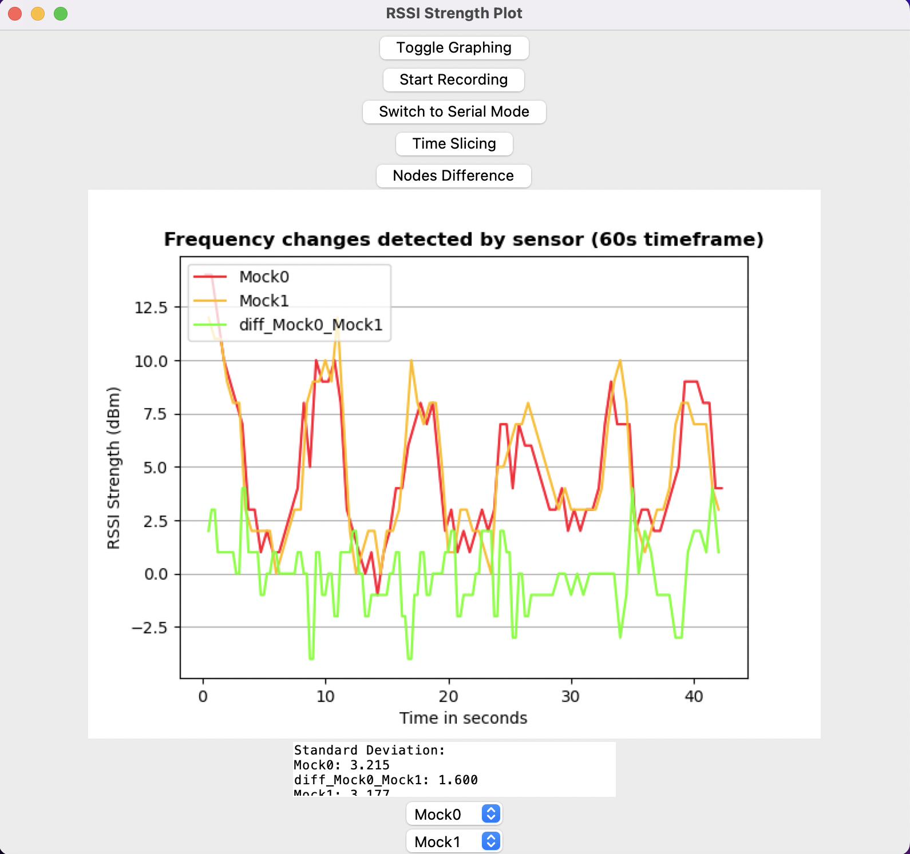
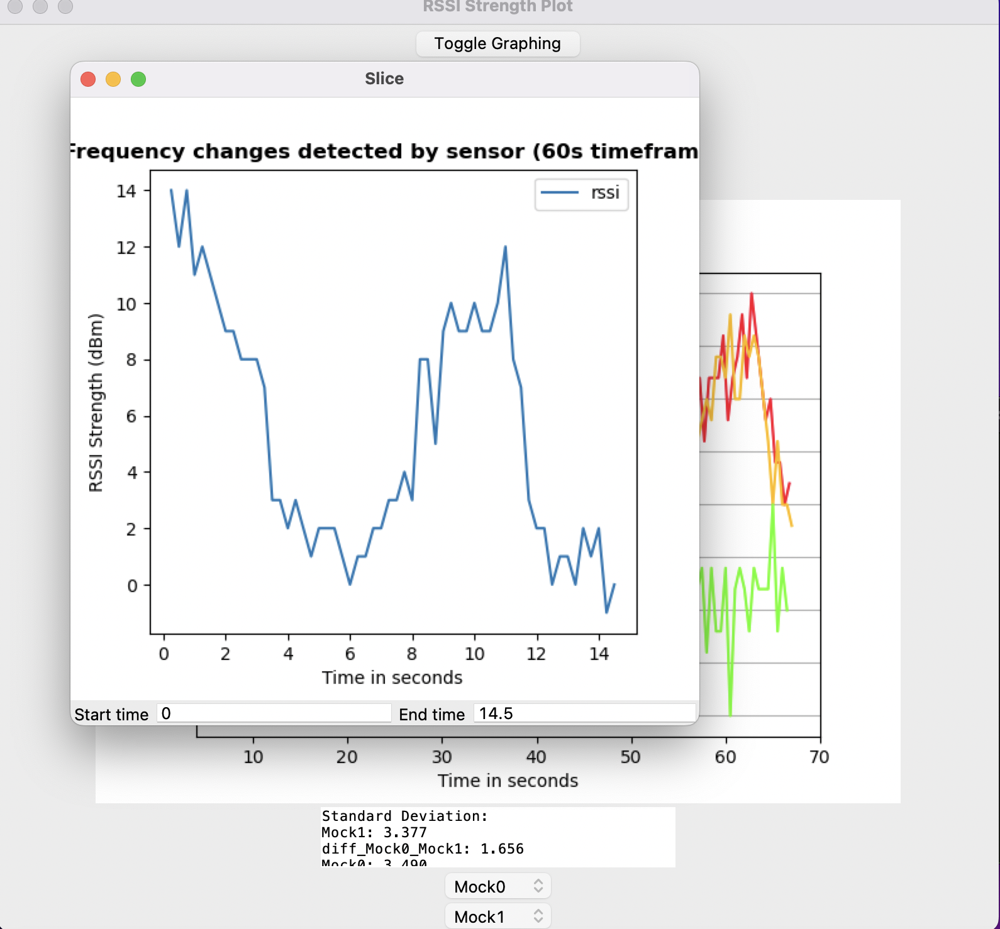
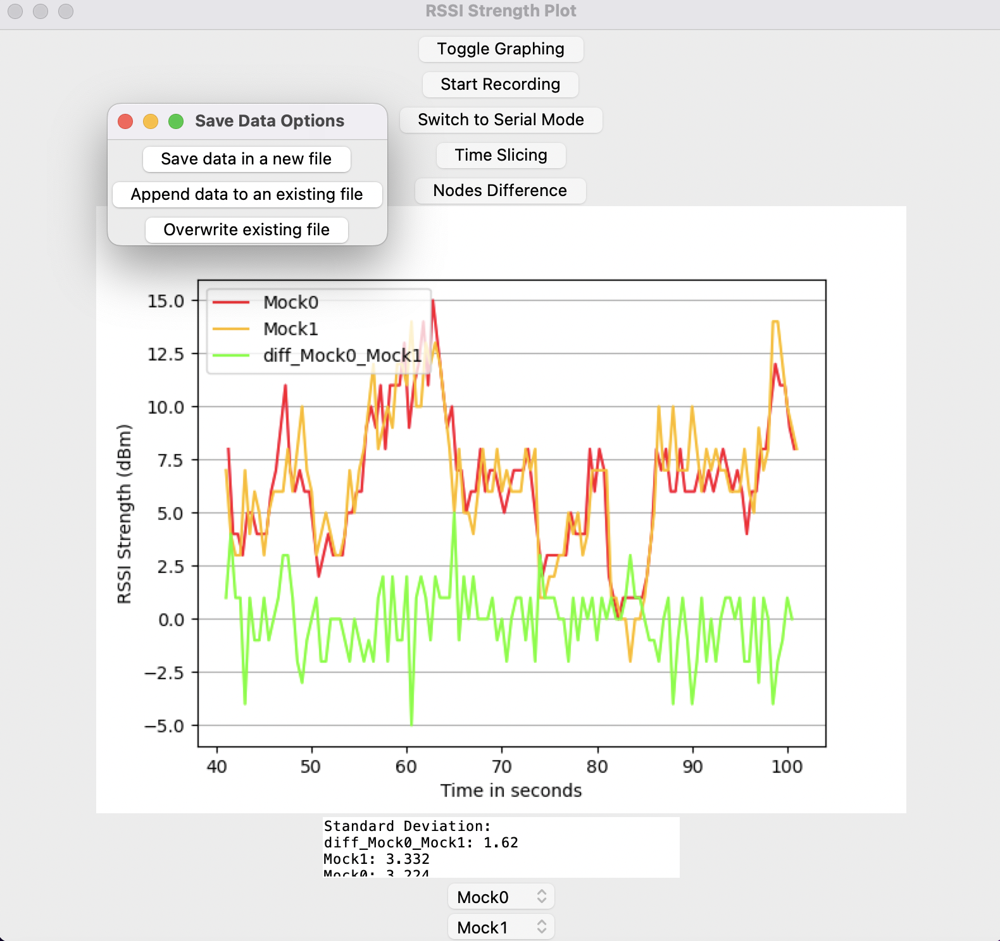
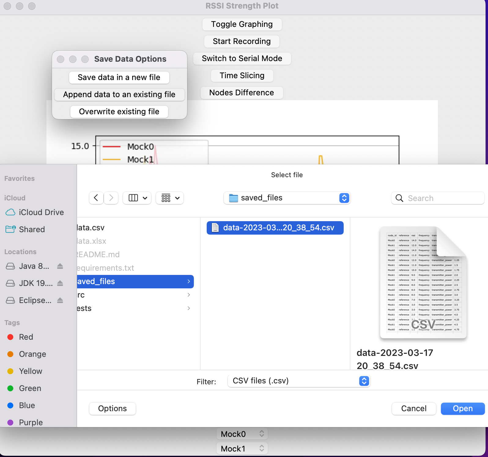

# SH16 Main

## Badges

## Name

SH16 - Embedded Systems Graphing Tool

## Description

This project uses Python's Tkinter library as the basis for it's graphical user interface. It also utilises the matplotlib (plt) library to graph data, as well as other libraries found in the requirements document available in the repository. This software is used to graph data passed by embedded systems.

## Installation

Run this command to ensure all packages used are installed!

pip install -r requirements.txt

or 

python -m pip install -r requirements.txt

Then run this in your terminal to run the program:

python -m gui

## Usage

- Connect the boards to a power source
- Start the program.
- Temporarily stop the graphing by using the toggle button at the top
- Record your graph data using the Start Recording function and save it using the Stop Recording button
## Support

If you find an issue with the functionality, our contact details can be found [here](https://stgit.dcs.gla.ac.uk/team-project-h/2022/sh16/sh16-main/-/wikis/home)!

## Roadmap

- ~~Create a minimum viable product (MVP) to present to the customer~~
- ~~Build around the MVP as the baseline for the final product~~
- ~~Accomodate incoming serial data, and be flexible with how to display it~~
- ~~ Ensure good coverage for tests.~~
- ~~Finalising the UI Design.~~
- ~~Add additional functionality such as saving files and loading files!~~
## Contributing

Not open to direct contributions, but if you find an problem with the functionality, feel free to open an issue and we'll get to working on it!

## Authors and acknowledgment

created by SH16:
- Arturo Miguel Lameg
- Alistair Johnston
- Benjamin Cochrane
- Faris Bin Mussalam
- Hana El Sherbeny
- Martin Suchan

## License

This software is licensed under GPL3. More details can be found [here](https://www.gnu.org/licenses/gpl-3.0.html)

## Project status

Everything works! Thank you for your patience! 

## Visuals

